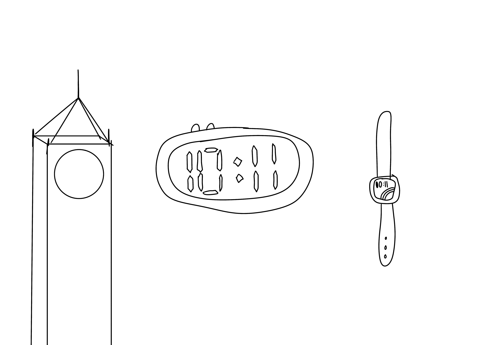
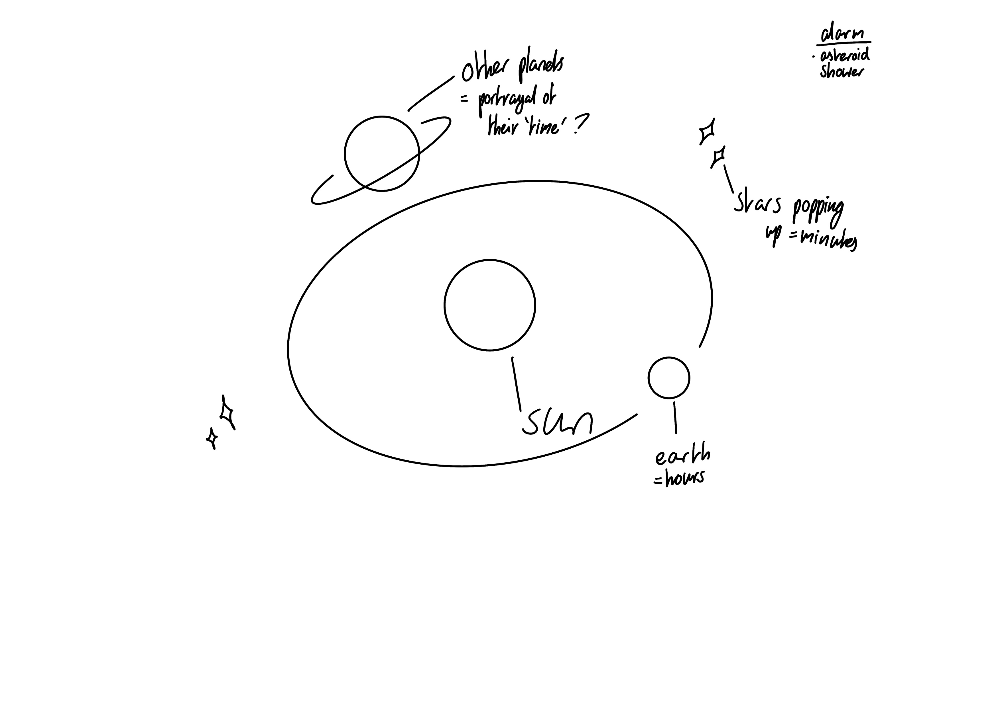
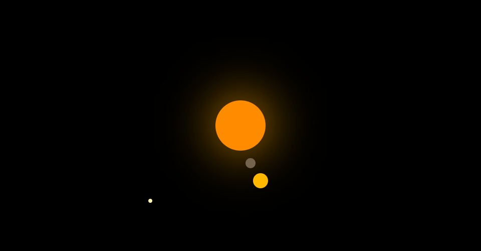

## MDDN 242 Project 1: Time-based Media  

### THIS IS YOUR README

Update this file as you go along to record your progress.

29/02
Updated sketch.jpg with current stage of idea and began experimenting with maeda clock visuals. Coding is a bit rusty at this point but will reread old assignment codes to rejog my memory.
.png>)

7/03

14/03

15/03
.jpg>)