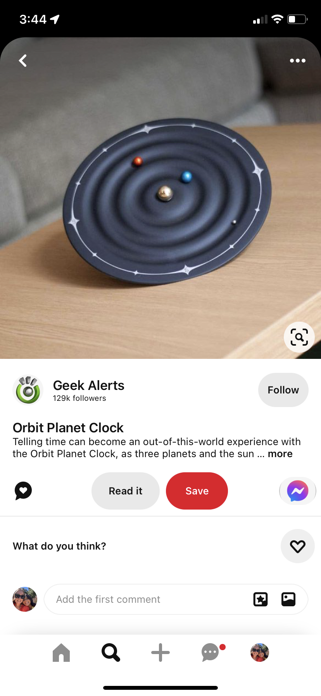
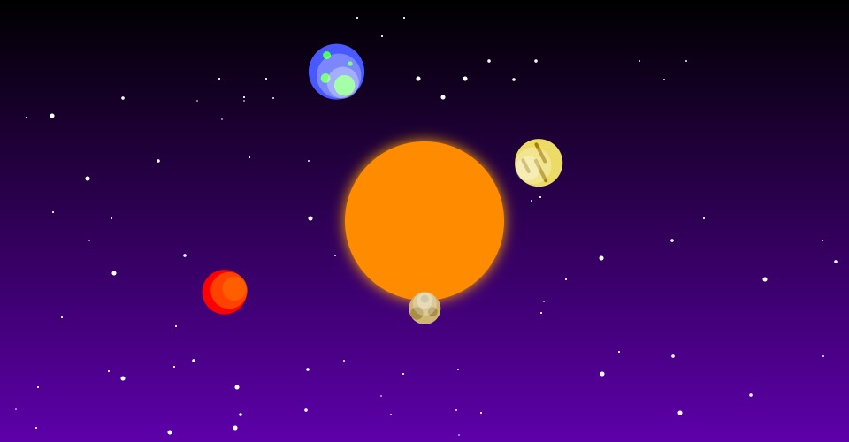

# MDDN 242 Project 1: Time-based Media  
## Github username: ezmhme
## Emerson Hemingway
## Solar Clock

### Design Intent:

For this assignment I intend to create a clock that portrays time with the theming of the solar system in mind. Each planet represents milliseconds, seconds, minutes and hours. Although these aspects are portrayed, they are not the main attraction of my concept. I intend to create a visually interesting aesthetic, as well as showing space and its vastness. My inspiration for this theming came from a physical clock with solar system theming, but seeing this also made me think about how interesting it is that all the planets in our solar system have different systems of time due to the gravitational pull of the sun. This is something I would've liked to experiment with further with my clock but unfortunately could not find the time to execute. Nonetheless was something that sparked my joy within this project!

### Process:

I began by updating sketch.jpg with the current stage of my idea and began experimenting with maeda clock visuals. My coding is a bit rusty at this point but will reread my old assignment codes to rejog my memory.
.png>)

For my Maeda clock interpretation I decided to do the second clock as, although it is quite hard to read the time I really enjoy the visual simplicity of the circles and primary colours. Replicating the visuals of this clock was enjoyable and a good refresher of the code that I may be using in my final clock.
.png>)

At this point my idea has changed so I've created a new sketch and added this in.

Inspiration for new idea:

Beginning stages of coding visuals.

Here I was experimenting with some other colour palettes and what kind of detailing/aesthetics I wanted my planets to have. I also was beginning to look into how to bring various size and locations of stars for my background visuals at this stage.
.jpg>)

More progression with visuals, decided to do a gradient in my background which was very difficult to figure out at first but was able to execute by reading through and using some of the code from this link: (https://editor.p5js.org/REAS/sketches/S1TNUPzim).
.jpg>)

At this stage I was trying to get my starry background looking as accurate and natural as possible, as well as sarting to experiment with my alarm visuals of an asteroid shower.
At this point of the stars development I was unhappy as they weren't looking natural enough, a lot of them were lining up awkwardly and looked a bit too "perfect".
.jpg>)

More development of stars and trying to get the most natural looking constellation tyoe visuals.
.jpg>)
.jpg>)

At this final stage I was editing my alarm visuals and adding in my meteors and perfecting their movement through the canvas. I got help with this from this link: (https://editor.p5js.org/cs4all/sketches/r15PGrT2Z).
.jpg>)

Final Clock:

### Reflection:

I am very pleased with how my final design for my clock turned out! My visuals turned out exactly how I was wanting and for that I'm very pleased. If I were to have had a bit more time I would have liked to give the meteors/asteroids more detail, as well as adding an effect to my stars to make them twinkle with a time variable. Unfortunately my coding memory was still a bit rusty when beginning this project, therefore some efficiency efforts did not go as planned, for most I was unable to get some aspects working so within functions, arrays, etc so sadly had to simplify and write some code in a less efficient manner. Aside from these aspects I am very pleased with how my project turned out and will be sure to focus on my weaknesses in the next assignments so that they don't slow me down.